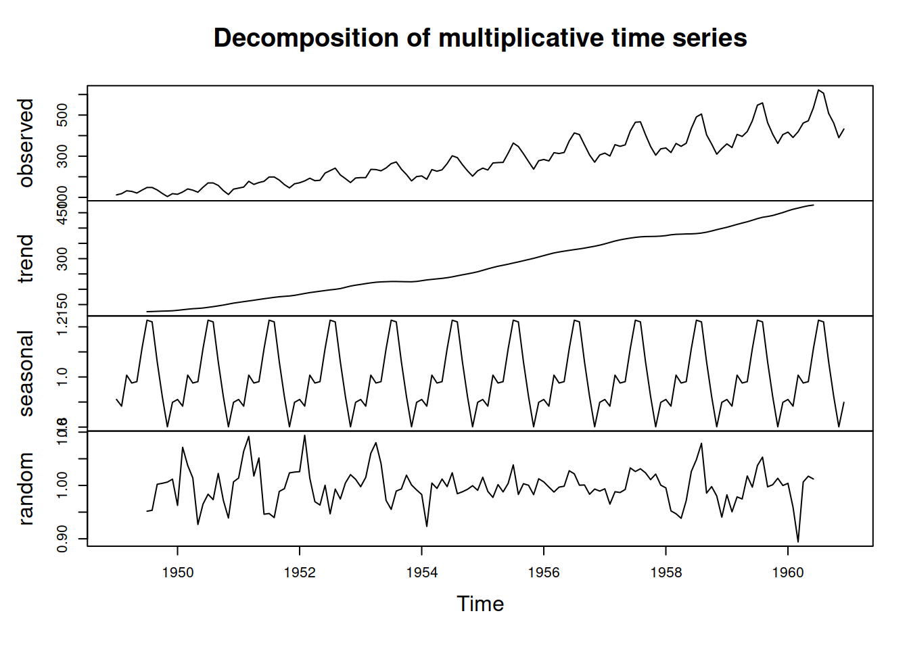

To state it simply, it's a collection of observations obtained through repeated measurements of time. The intervals of which time series are represented are vast ranging from Yearly to Hourly and more.

### Aim of TSA

It's typically used for three scenarios:

---
* <strong>Access a Single event <em>(descriptive)</em></strong>
	For instance, analyzing the number of crimes in a city over the past five years to identify any seasonal patterns or potential linear trends in the crime rate.
---
* <strong>To study the patterns ie. effects of variables rather than events itself <em>(explanatory)</em></strong>
	Examining how changes in temperature and humidity affect the growth patterns of a certain plant species over different seasons.
---
* <strong>To forecast the future values of a time series using the given time series <em>(prediction)</em></strong>
	Forecasting future stock prices based on historical price data and lagged variables.
---

  
### Steps in TSA

* Explore the data

* Identify the data

* Model the data

* Predict

### Components of TSA

---
* <strong>Trend</strong> - The Linearity(increasing-decreasing)
---
* <strong>Cyclic</strong> - repeated patterns of non-periodic fluctuations(span to operate themselves over two years)
---
* <strong>Seasonality</strong> - Repeating patterns of behavior over less than a year
---
* <strong>Random/Irregular Movements(noise)</strong> - Variation that cannot be explained. Noises should be less for accurate study of the time series so that's why appropriate interval of time should be chosen.
---

The combination of any of these components can be either Additive or Multiplicative.

<strong>Additive:</strong> the increasing or decreasing pattern of the time series is similar

<em><strong>Y=trend + cyclic + seasonality + noise</strong></em>

<strong>Multiplicative:</strong> if time series has exponential growth of decrement with time

<em><strong>Y=trend * cyclic * seasonality * noise</strong></em>

  

Here in the additive model, we have somewhat consistent amplitude between the time points but in multiplicative model we have changing amplitude model between time points overtime.

#### Decomposition of Multiplicative Time Series

  

After understanding the trend, seasonality and noise of out data, we should check if the series if stationary or not. If not, we have to make it stationary to further objective.

  
## Stationarity

If the statistical properties such as mean, variance & covariance remain constant over time then it passes the stationarity check. The stationarity of data typically depends upon mean, variance and co-variance.

This type of data is flat looking.

You would get a constant variance, mean and co-variance structure over time. This implies that the model will predict the data assuming the mean and the variance will remain the same in the future period.

<strong>We can check the stationarity with both:</strong>

* Visually(the [[#Decomposition of Multiplicative Time Series]])

* Statistically(commonly used are the [[ADF and KPSS test]])

    * Augmented Dickey-Fuller Test (ADF): This is a statistical hypothesis test to determine stationarity. It tests the null hypothesis that a unit root is present in a time series, indicating non-stationarity. If the p-value obtained from the test is below a significance level (e.g., 0.05), then the time series is likely stationary.

    * Kwiatkowski-Phillips-Schmidt-Shin (KPSS) Test: This is another hypothesis test for stationarity. It tests the null hypothesis that the time series is stationary around a deterministic trend. Conversely, a low p-value indicates non-stationarity.

    *  Other tests are - Phillipps-Perron test, Zivot-Andrews test, ADF-GLS test

**To make the series stationary, there are two ways: differencing and logarithmic transformation.**

* ### Differencing:

Differencing is the process of subtracting <em>Yt-1</em> from <em>Yt</em>, taking the difference ∇<em>Yt = Yt - Yt-1</em>. This is first ordering differencing.

Differencing helps to remove the trend and other non-stationary components from the time series, leaving behind only the stationary component. If the original time series has a linear trend, first-order differencing can often remove it. However, in some cases, higher-order differencing (taking the difference between successive differences) may be necessary to achieve stationarity. For example, second-order differencing can be written as:
Second-order differencing:  ∇2<em>Yt</em> = ∇<em>Yt</em> - ∇<em>Yt-1</em>

* ### Logarithmic Transformation:

	Time series data can sometimes exhibit non-constant variance, where the spread of data points increases or decreases over time. This phenomenon is known as heteroscedasticity. Heteroscedasticity can make it challenging to apply certain time series models that assume constant variance, such as linear regression.

A logarithmic transformation is one way to stabilize the variance of a time series with an increasing spread. By taking the natural logarithm of each data point in the series, we compress the larger values and expand the smaller values. This tends to reduce the magnitude of the variations, making the variance more constant across time.

Mathematically, the logarithmic transformation can be represented as:

Logarithmic Transformation: <em>Yt′​=log(Yt​)</em>
Where *Yt′​​* represents the transformed series, and *Yt​*​ is the original time series data at time *t*.

By stabilizing the variance using logarithmic transformation and stabilizing the mean by differencing, we can prepare the time series for various time series analysis techniques, such as ARIMA (Auto Regressive Integrated Moving Average), which often assume constant variance and stationarity to produce meaningful results. These transformations are part of the broader process of data pre-processing in time series analysis, where the goal is to make the data suitable for modeling and forecasting.

**Now, let's look at [Autocorrelation](obsidian://open?vault=ObsidianNote&file=2-Autocorrelation)to further our understanding of ARIMA model**
