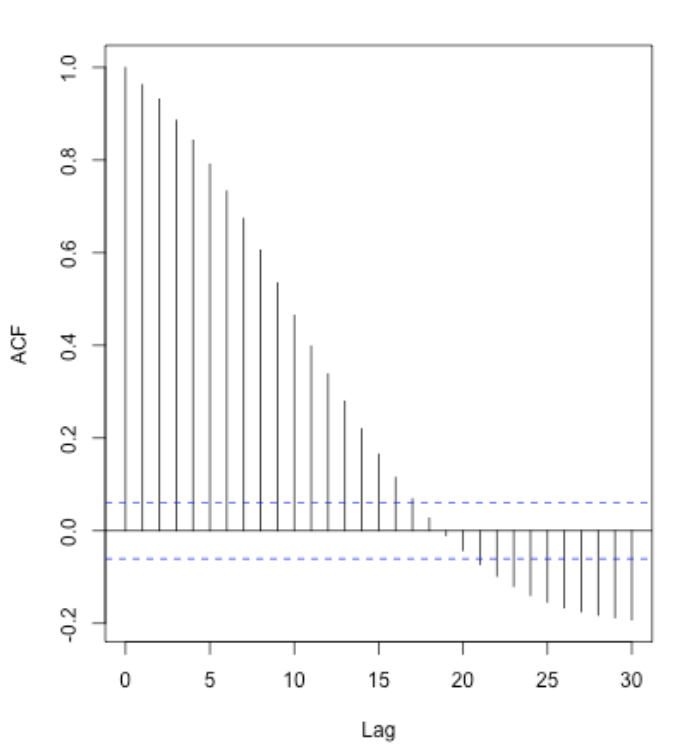

### Autocorrelation Function (ACF) and Stationarity:

Autocorrelation measures the correlation between a time series and its lagged values. It assesses the relationship between past observations and the current observation at different lags. In a stationary time series, the autocorrelation typically decreases with increasing lag because the influence of past observations diminishes over time.

### Characteristics of Stationary Time Series:

1. **Constant Statistical Properties:** In a stationary time series, the mean, variance, and autocorrelation remain constant over time.
2. **No Trend or Seasonality:** Stationary time series do not exhibit long-term trends or repeating seasonal patterns.
3. **Constant Autocorrelation:** While the magnitude of autocorrelation may vary at different lags, the overall pattern should not change. It should show a gradual decrease or fluctuations around zero.

### Interpreting ACF in Relation to Stationarity:

1. **Gradual Decrease in ACF:** A gradual decrease in autocorrelation with increasing lag is a characteristic of stationary time series. It indicates that the current value of the time series is less dependent on past values as the time lag increases.

2. **Fluctuations around Zero:** In some stationary time series, the ACF may fluctuate around zero without any consistent pattern. This is also a sign of stationarity.

### Autocorrelation and Non-Stationarity:

If the autocorrelation of a time series is increasing with lag, it suggests that there is a strong dependence of the current value on past values of the time series. This pattern is not typical of stationary time series. Instead, it can be an indication of non-stationarity, where the statistical properties of the series change over time.

In the case of non-stationary time series with increasing autocorrelation, it may be necessary to apply techniques like differencing, detrending, or transforming the data to achieve stationarity before modeling it with techniques like ARIMA.

In summary, a gradual decrease in autocorrelation with increasing lag is a characteristic of stationary time series, while an increasing autocorrelation pattern may suggest non-stationarity. Understanding the autocorrelation structure is crucial in identifying the appropriate modeling approach for time series analysis and forecasting.

**However,**  if the ACF starts increasing again after initially decreasing, it suggests that the time series exhibits a **seasonal pattern**. A seasonal pattern refers to repeating patterns or cycles that occur at regular intervals within the time series. Seasonality can be observed in various contexts, such as quarterly sales data showing higher values during certain quarters each year or monthly temperature data displaying fluctuations due to changing seasons.

### Interpreting the ACF for Seasonality:

1. **Initial Decrease in ACF:** When examining the ACF plot, you may observe an initial decrease in autocorrelation as the lag increases, which is typical for stationary time series.

2. **Subsequent Increase in ACF:** After the initial decrease, if the ACF starts increasing again at regular intervals, it indicates the presence of a seasonal pattern. The periodic spikes in the ACF at those intervals reveal the influence of past observations that repeat with each seasonal cycle.

***When a seasonal pattern is detected in the ACF plot, it is crucial to consider this seasonality during time series modeling and forecasting. A popular approach to address seasonality is to use seasonal differencing in combination with an appropriate seasonal ARIMA (SARIMA) model.***

### Partial Autocorrelation Function(PCAF):

- Partial autocorrelation is a summary of the relationship between an observation and its prior observations with the influence of intervening observations removed.

- PACF measures the correlation between two values that are lags apart after adjusting for the effects of all the other intermediate values.

- In other words, PACF measures the correlation between a value and its lag, but with the influence of other lags removed.

## Differences between ACF and PACF:

- ACF measures the direct correlation between observations at different lags, while PACF measures the correlation after removing the influence of intervening lags.
- ACF is useful in identifying any serial correlation, including both AR and MA processes.
- PACF is specifically helpful in determining the order of the AR process.

# Mathematical Interpretation of ACF and PCAF

## 1. Autocorrelation Function (ACF)

The ACF at lag _k_ measures the correlation between the time series observation at time _t_ and the observation at time _t-k_ (k time steps in the past), while considering all the observations in between. The ACF can be mathematically represented as:

ACF(<em>k</em>) = Corr(Yt, Yt-k)

Where:

- Yt is the time series observation at time _t_.
- _Yt-k_ is the observation at time _t-k_ (k time steps in the past).
- Corr( ) represents the correlation function that calculates the correlation between two variables.

## 2. Partial Autocorrelation Function (PACF):

The PACF at lag _k_ measures the correlation between the time series observation at time _t_ and the observation at time _t-k_ (k time steps in the past), but this time it removes the influence of all the observations in between (i.e., lags 1 through _k-1_). The PACF can be mathematically represented as:

PACF(_k_) = Corr(Yt, Yt-k | Yt-1, Yt-2,....., Yt-k+1)

PACF(_k_) = Correlation between _Yt_ and _Yt-k_, after removing the influence of _Yt-1_, _Yt-2_,....., _Yt-k+1_.

In words, the PACF at lag _k_ is the correlation between _Yt_ and _Yt-k_, but it only considers the direct influence of the observation at time _t-k_ (lag _k_) while removing the influence of the observations at lags 1 through _k-1_.

## Example: 

Suppose we have a time series of monthly sales data, and we want to understand the relationship between current month's sales and sales that happened 3 months ago. Let's calculate the ACF and PACF for this example:

- ACF(3): This will measure the correlation between the current month's sales and sales that occurred 3 months ago, considering all the sales in between.
- PACF(3): This will measure the correlation between the current month's sales and sales that occurred 3 months ago, but it will remove the influence of sales from the previous 2 months (i.e., lag 1 and lag 2).

The PACF(3) will give a more direct measure of the correlation between current month's sales and sales from exactly 3 months ago without being influenced by sales from the intervening months.